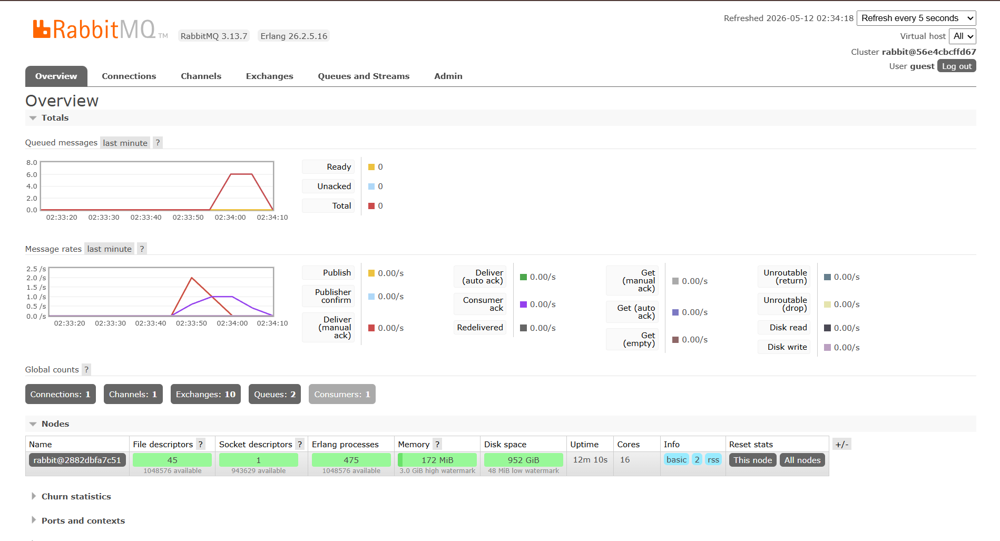
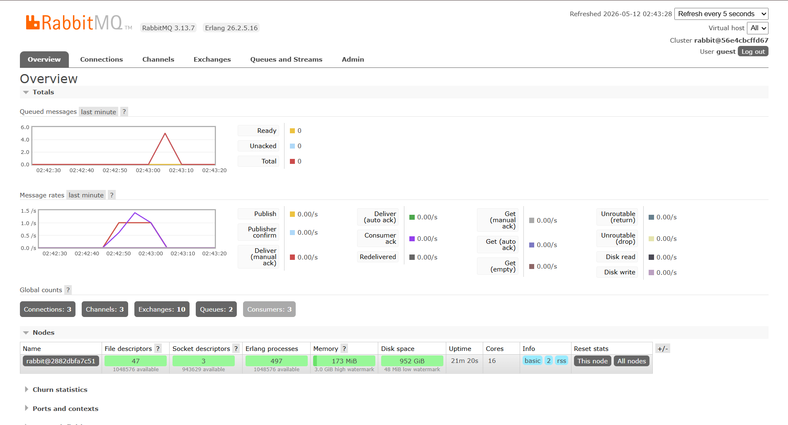

# Reflection

### a. What is AMQP?
 
AMQP merupakan singkatan dari Advanced Message Queuing Protocol, dan AMQP itu sendiri merupakan sebuah protokol (seperti HTTP) khusus untuk mengirim pesan antar aplikasi. Bedanya dengan HTTP, AMQP bersifat asynchronous sehingga tidak perlu menunggu response sebelum mengirim request kembali.

### b. What does it mean? guest:guest@localhost:5672 , what is the first guest, and what is the second guest, and what is localhost:5672 is for?

guest:guest@localhost:5672 merupakan URL tempat message broker dari AMQP yang kita gunakan. guest pertama merupakan username, dan guest kedua merupakan password default dari username tersebut (biasanya hanya dipakai untuk kebutuhan local). localhost:5672 menunjukkan address serta port yang digunakan.

### Simulation slow subscriber

Pada grafik, terlihat bahwa queued message mencapai angka 6. Artinya, sempat ada 6 pesan yg ketahan di queue sebelum diproses. Hal ini terjadi karna tiap pesan ada delay 1 detik setiap pesan. 

### 3 Subscriber simulation

Terlihat bahwa spike pada queue menurun dengan lebih cepat. Hal ini terjadi karena RabbitMQ membagi pesan kepada semua subscriber yang tersedia secara bergantian, jadi misal pesan 1 ke subscriber 1 dulu, pesan 2 ke subscriber 2, dst.